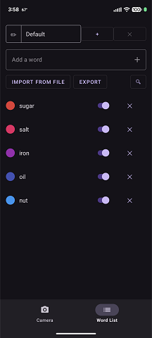
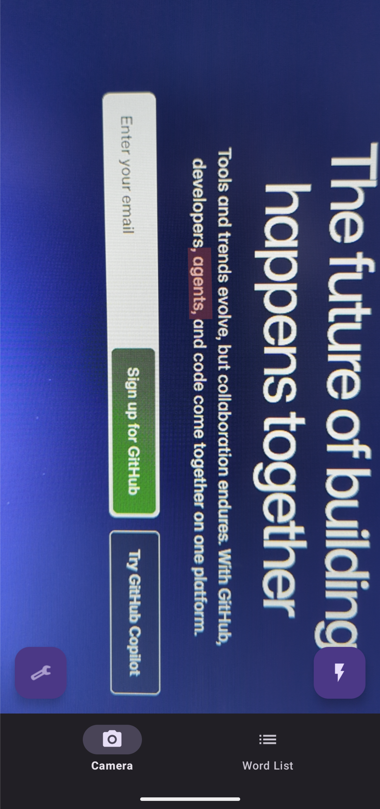
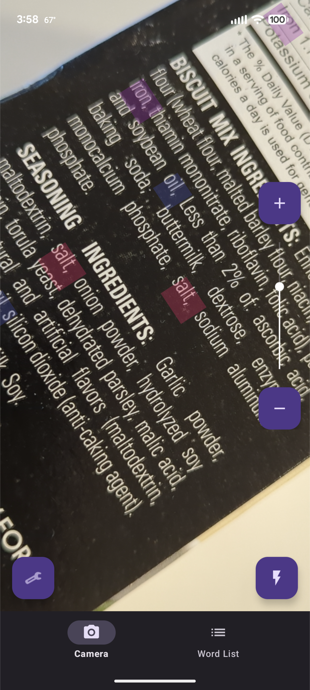

# WordFido
gi
An Android app that uses your camera to scan for words in real time. Build a watchlist of words, point the camera at text, and WordFido highlights every match as it appears.

---

## How it works

1. **Add words** — type a word into the Word List tab and tap **+**
2. **Point the camera** — switch to the Camera tab and aim at any text
3. **See highlights** — matched words are outlined instantly as they come into frame

---

## Features

### Word detection
- Real-time OCR powered by ML Kit Text Recognition
- Color-coded highlight boxes drawn over matched words in the camera preview
- Whole-word matching toggle — match exact words or allow partial matches
- Case-sensitive matching toggle
- Confidence filtering — low-confidence detections are silently ignored

### Word list
- Add, remove, and toggle words individually
- Assign a color to each word — the highlight box uses that color
- Multiple named profiles — switch lists without losing the others
- Rename and delete profiles
- Import a word list from a plain-text file (one word per line)
- Export the current list via the system share sheet
- Search your word list with the search toggle

### Camera
- Pinch-to-zoom gesture on the preview
- Optional on-screen zoom bar (+ / − buttons and a vertical slider) via the settings menu
- Torch / flash toggle
- Frame throttling — processes at most one frame every 300 ms to conserve battery

### Feedback
- Haptic pulse when a new word is first detected
- Audio tone on detection (choose from Beep, Prompt, or Ack)
- Both can be toggled independently from the camera settings menu

---

## Screenshots

Wordlist screen:



Example of searching Github's home page for "agent":



Example of searching an ingredient list for mulitple words, at an angle:



---

## Requirements

- Android 8.0 (API 26) or higher
- A rear-facing camera
- Camera permission (requested on first launch)

---

## Tech stack

| Layer | Library |
|---|---|
| Camera | CameraX 1.4 |
| OCR | ML Kit Text Recognition |
| Database | Room + KSP |
| Dependency injection | Hilt |
| Async | Kotlin Coroutines + Flow |
| Navigation | Jetpack Navigation Component |
| UI | View-based (ConstraintLayout, Material Components) |

---

## Building

Clone the repo and open in Android Studio. No API keys or local configuration required — the app builds and runs as-is.

```bash
git clone https://github.com/ghpotter/WordFido.git
```

Minimum tools: Android Studio Hedgehog or later, JDK 11.
